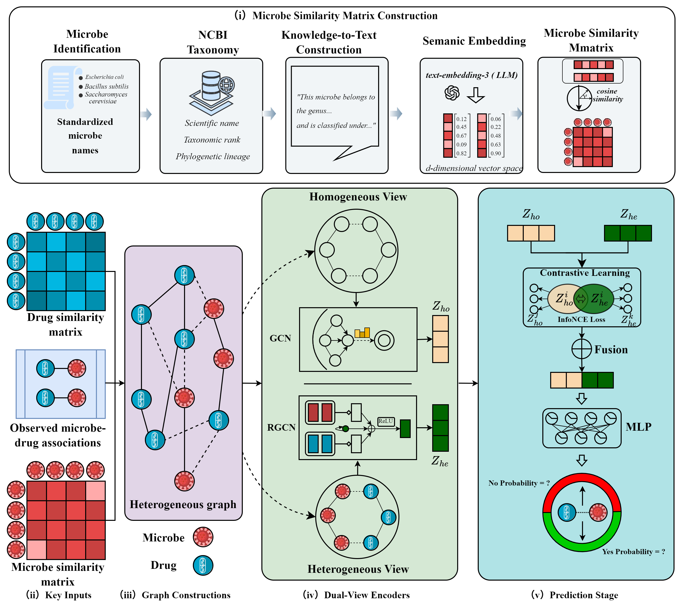

# MDI

PyTorch implementation for **MDI: A Dual-View Deep Learning Framework for Microbe--Drug Association Prediction with Microbial Semantic Representations**.

## Overview

This repository contains the implementation of **MDI**, a multi-view deep learning framework for microbe--drug association prediction.  
The model integrates:

- **structural information** from observed microbe--drug associations,
- **homogeneous similarity information** from microbe--microbe and drug--drug graphs,
- **microbial semantic representations** derived from taxonomy-aware text and large language model embeddings.

MDI learns two complementary views and aligns them through contrastive training, then fuses the resulting representations for downstream association prediction.

## Framework

> **Main figure placeholder for the paper / GitHub page**



**Figure 1.** Overall framework of **MDI**. The model integrates a homogeneous similarity view and a heterogeneous interaction view, incorporates microbial semantic embeddings, performs cross-view alignment, and predicts microbe--drug associations through a fused decoder.

## Usage

The main training and evaluation entry is implemented in `3.py`.

To reproduce the main experiments:

```bash
git clone https://github.com/yourusername/MDI.git
cd MDI
```

Install dependencies in your Python environment:

```bash
pip install -r requirements.txt
```

Run the main experiments:

```bash

```

For the curated 5-fold result pipeline used in our experiments:

```bash
python3 run_final_results.py
```

## Additional Experiments

This repository also includes scripts for the major experimental analyses used in the paper:

- **Ablation study**
  
  ```bash
  python3 run_ablation_study.py
  ```

- **Sensitivity analysis**
  
  ```bash
  python3 run_sensitivity_analysis.py
  ```

- **Case study with evidence retrieval**
  
  ```bash
  python3 run_case_study_with_evidence.py
  ```

- **Microbial semantic masking ablation**
  
  ```bash
  python3 run_microbe_semantic_mask_ablation.py
  ```

- **Representation visualization**
  
  ```bash
  python3 make_publication_node_figure.py
  ```

## Project Structure

```text
MDI
│
├── dataset/                               # Benchmark datasets: MDAD, aBiofilm, DrugVirus
├── Ref/                                   # Reference methods / auxiliary baseline materials
│
├── 3.py                                   # Main training and evaluation script
├── experiment_utils.py                    # Shared utilities for fold-based experiments
├── run_final_results.py                   # Reproduce curated 5-fold result tables
├── run_ablation_study.py                  # Main ablation experiments
├── run_sensitivity_analysis.py            # Hyperparameter sensitivity analysis
├── run_case_study_with_evidence.py        # Case-study evaluation with literature evidence
├── run_microbe_semantic_mask_ablation.py  # Text-masking ablation on microbial semantic fields
├── make_publication_node_figure.py        # Publication-style visualization scripts
├── MD.png                                 # Framework illustration of MDI
├── README.md                              # Project description
└── requirements.txt                       # Python dependencies
```

## Microbial Semantics

The microbial semantic branch is constructed from taxonomy-aware text that includes:

- **microbe name**
- **taxonomic rank**
- **lineage**
- **synonyms**

These textual descriptions are encoded into dense embeddings and used as microbial semantic inputs in the dual-view framework.

## Datasets

The repository currently supports three datasets:

- `MDAD`
- `aBiofilm`
- `DrugVirus`

Each dataset contains the observed association matrix, microbe/drug similarity matrices, and the processed microbial semantic files.

## Citation

If you use this repository in your research, please cite our work.

```bibtex
@article{mdi2026,
  title   = {MDI: A Dual-View Deep Learning Framework for Microbe--Drug Association Prediction with Microbial Semantic Representations},
  author  = {Author information to be added},
  journal = {To be added},
  year    = {2026}
}
```

## Notes

- `MD.png` is the framework figure currently used as the main visual overview.
- Several scripts generate publication-ready figures, supplementary tables, and case-study reports.
- If you release this repository publicly, please make sure to remove any local secrets or API keys before publishing.
