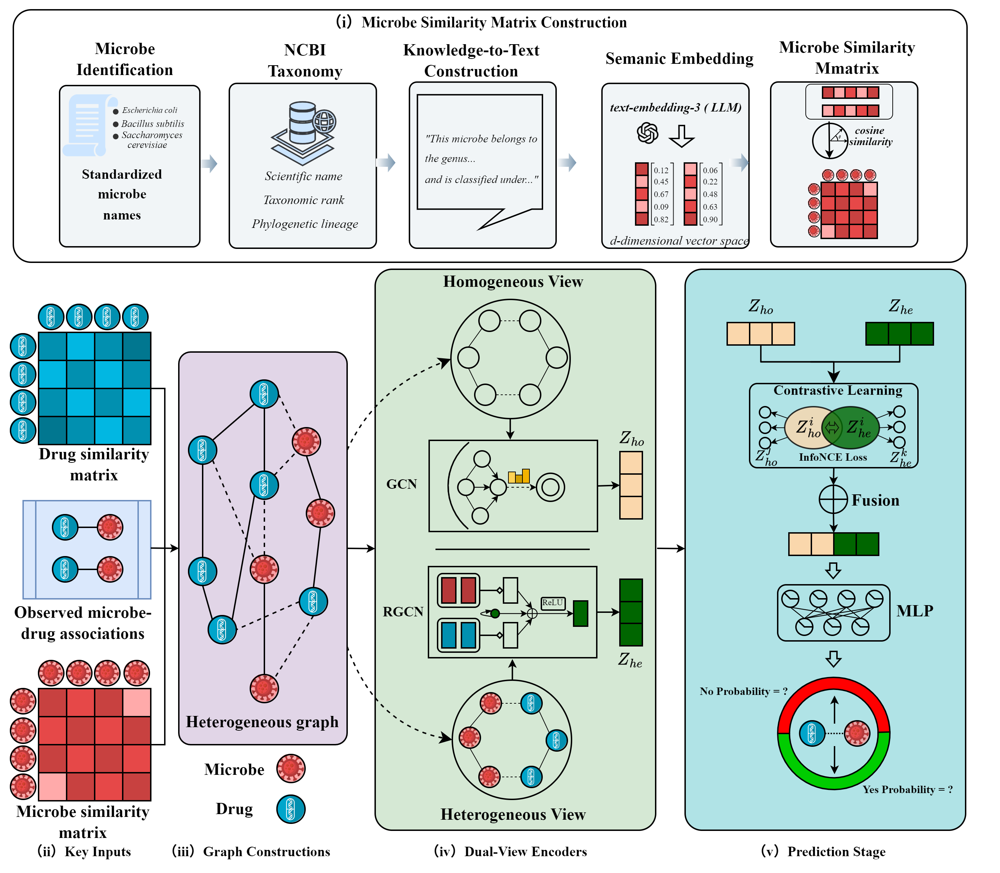

# MDI

PyTorch implementation of **MDI: A Dual-View Deep Learning Framework for Microbe–Drug Association Prediction with Microbial Semantic Representations**.

## Overview

MDI predicts associations between microbes and drugs by combining observed interaction structure, homogeneous similarity graphs, and taxonomy-aware microbial semantic representations. It learns a homogeneous similarity view and a heterogeneous interaction view, aligns the two views during training, and fuses their representations for association prediction.

## Framework



**Figure 1.** Overview of the MDI framework.

## Installation

Download or clone this repository, open its root directory, and install the dependencies:

```bash
python -m pip install -r requirements.txt
```

The implementation uses PyTorch and PyTorch Geometric. CUDA is used automatically when available; otherwise, the model runs on CPU. For GPU execution, install a PyTorch build compatible with your CUDA environment.

## Prepare the datasets

The processed dataset package is named `MDI_processed_datasets.zip`. Place it in the repository root and extract it:

```bash
python -m zipfile -e MDI_processed_datasets.zip .
```

The archive creates `dataset/MDAD`, `dataset/aBiofilm`, and `dataset/DrugVirus`. If these directories are already present with the files listed below, extraction is unnecessary.

### Dataset statistics


### Files in each dataset directory

| File | Description |
| --- | --- |
| `adj.txt` | Tab-separated observed associations: `drug_id`, `microbe_id`, `label`. IDs are **1-based** and labels are `1`. |
| `microbes.txt` | Microbe names in node-index order. |
| `drugs.txt` | Drug names in node-index order. |
| `microbes_facts.csv` | Taxonomy metadata and the serialized microbial semantic text. |
| `microbes_embeddings.csv` | Precomputed microbial semantic embeddings: one row per microbe, an index column, and 1,536 numeric features. |
| `microbesimilarity.txt` | Tab-separated square microbial semantic similarity matrix. |
| `drugsimilarity.txt` | Tab-separated square drug similarity matrix; the supplied files use interaction-derived Gaussian interaction profile (GIP) similarity. |

`adj.txt` is an **edge list**, not a dense association matrix. A node ID corresponds to its line number in the relevant name file. Embedding rows and similarity-matrix rows/columns follow the same node order. Unobserved pairs are unlabeled and are not experimentally confirmed negatives.

The archive also contains `dataset/DATA_README.md` and `dataset/MANIFEST.json`, including file descriptions, dataset counts, and SHA-256 checksums.

## Training and evaluation

The entry point is `mdi.py`. The following example configurations run one fixed-seed evaluation on each dataset with a 1:1 evaluation positive-to-negative ratio:

### MDAD

```bash
python mdi.py --dataset_dir ./dataset/MDAD --seed 42 --epochs 200 --eval_neg_ratio 1 --topk 15 --lr 0.001 --hidden 128 --out 128 --lam_cl 0.2
```

### aBiofilm

```bash
python mdi.py --dataset_dir ./dataset/aBiofilm --seed 42 --epochs 200 --eval_neg_ratio 1 --topk 30 --lr 0.0005 --hidden 256 --out 256 --lam_cl 0.1
```

### DrugVirus

```bash
python mdi.py --dataset_dir ./dataset/DrugVirus --seed 42 --epochs 200 --eval_neg_ratio 1 --topk 25 --lr 0.0007 --hidden 192 --out 128 --lam_cl 0.1
```

View all available arguments:

```bash
python mdi.py --help
```

The script reports evaluation metrics, including AUC and AUPR, and saves the selected model weights as `paperstyle_closedworld_best.pt` in the dataset directory. Re-running the same dataset overwrites this checkpoint.

### Evaluation protocol

These examples use an 80%/10%/10% split of observed positive edges for training, validation, and testing. The checkpoint is selected using validation AUC. They demonstrate a single run of the supplied implementation; they do not reproduce five-fold means or standard deviations.

The default implementation retains the full observed MDI graph for message passing and uses the supplied precomputed similarities. A training-only evaluation requires rebuilding both the MDI graph and interaction-derived similarities from training interactions. `--train_graph_only 1` changes the MDI message-passing edges but does not recompute the supplied GIP similarity.

## Microbial semantic representations

For each microbe, taxonomy information is serialized using the following template:

```text
Microbe Name: <name>. Rank: <rank>. Lineage: <lineage>. Synonyms: <synonyms>.
```

The metadata fields include microbe name, taxonomic rank, lineage, and synonyms. The descriptions are encoded into dense vectors, and pairwise cosine similarity is computed from those vectors. The model uses both the microbial semantic embeddings and the microbial similarity graph.

Precomputed embeddings and similarity matrices are included in the dataset package. **No API key or online embedding request is required to train the model using these files.**

## Project structure

```text
MDI/
├── dataset/
│   ├── MDAD/
│   ├── aBiofilm/
│   ├── DrugVirus/
│   ├── DATA_README.md
│   └── MANIFEST.json
├── mdi.py
├── MD.png
├── README.md
└── requirements.txt
```

## Citation and data attribution

If you use this implementation, please cite the MDI manuscript and the original publications for the datasets used in your experiments. Final citation information for the manuscript will be added when available. The processed files are derived from MDAD, aBiofilm, and DrugVirus; their original data sources and applicable terms remain relevant when reusing them.
